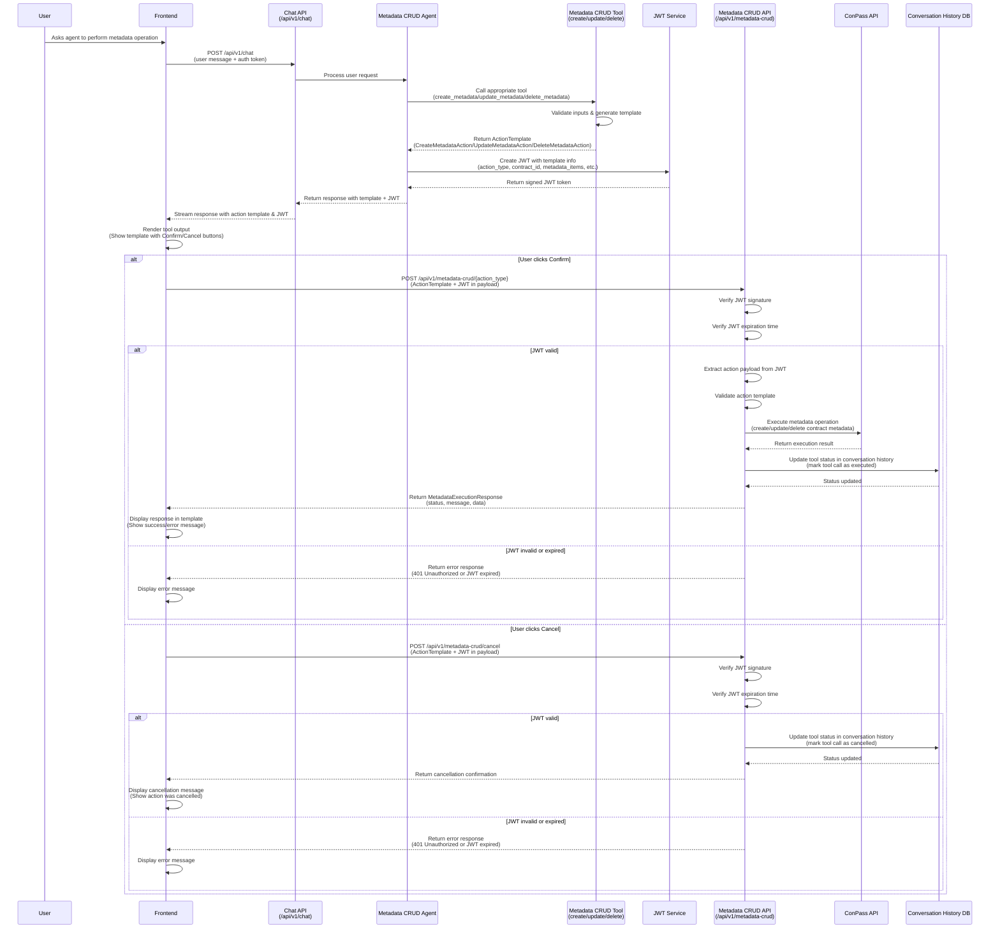

```mermaid
sequenceDiagram
    participant User
    participant Frontend
    participant ChatAPI as Chat API<br/>(/api/v1/chat)
    participant Agent as Metadata CRUD Agent
    participant Tool as Metadata CRUD Tool<br/>(create/update/delete)
    participant JWTService as JWT Service
    participant MetadataAPI as Metadata CRUD API<br/>(/api/v1/metadata-crud)
    participant ConPassAPI as ConPass API
    participant ChatHistoryDB as Conversation History DB

    User->>Frontend: Asks agent to perform metadata operation
    Frontend->>ChatAPI: POST /api/v1/chat<br/>(user message + auth token)

    ChatAPI->>Agent: Process user request
    Agent->>Tool: Call appropriate tool<br/>(create_metadata/update_metadata/delete_metadata)

    Tool->>Tool: Validate inputs & generate template
    Tool-->>Agent: Return ActionTemplate<br/>(CreateMetadataAction/UpdateMetadataAction/DeleteMetadataAction)

    Agent->>JWTService: Create JWT with template info<br/>(action_type, contract_id, metadata_items, etc.)
    JWTService-->>Agent: Return signed JWT token

    Agent-->>ChatAPI: Return response with template + JWT
    ChatAPI-->>Frontend: Stream response with action template & JWT

    Frontend->>Frontend: Render tool output<br/>(Show template with Confirm/Cancel buttons)

    alt User clicks Confirm
        Frontend->>MetadataAPI: POST /api/v1/metadata-crud/{action_type}<br/>(ActionTemplate + JWT in payload)

        MetadataAPI->>MetadataAPI: Verify JWT signature
        MetadataAPI->>MetadataAPI: Verify JWT expiration time

        alt JWT valid
            MetadataAPI->>MetadataAPI: Extract action payload from JWT
            MetadataAPI->>MetadataAPI: Validate action template

            MetadataAPI->>ConPassAPI: Execute metadata operation<br/>(create/update/delete contract metadata)
            ConPassAPI-->>MetadataAPI: Return execution result

            MetadataAPI->>ChatHistoryDB: Update tool status in conversation history<br/>(mark tool call as executed)
            ChatHistoryDB-->>MetadataAPI: Status updated

            MetadataAPI-->>Frontend: Return MetadataExecutionResponse<br/>(status, message, data)
            Frontend->>Frontend: Display response in template<br/>(Show success/error message)
        else JWT invalid or expired
            MetadataAPI-->>Frontend: Return error response<br/>(401 Unauthorized or JWT expired)
            Frontend->>Frontend: Display error message
        end
    else User clicks Cancel
        Frontend->>MetadataAPI: POST /api/v1/metadata-crud/cancel<br/>(ActionTemplate + JWT in payload)

        MetadataAPI->>MetadataAPI: Verify JWT signature
        MetadataAPI->>MetadataAPI: Verify JWT expiration time

        alt JWT valid
            MetadataAPI->>ChatHistoryDB: Update tool status in conversation history<br/>(mark tool call as cancelled)
            ChatHistoryDB-->>MetadataAPI: Status updated

            MetadataAPI-->>Frontend: Return cancellation confirmation
            Frontend->>Frontend: Display cancellation message<br/>(Show action was cancelled)
        else JWT invalid or expired
            MetadataAPI-->>Frontend: Return error response<br/>(401 Unauthorized or JWT expired)
            Frontend->>Frontend: Display error message
        end
    end
```
