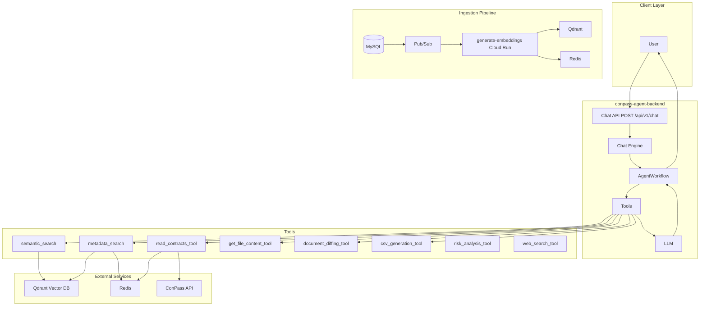
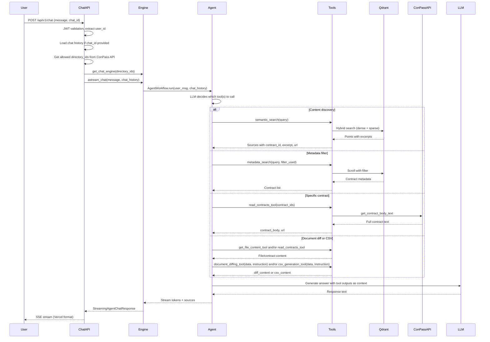

# ConPass AI Assistant — Overall Architecture

This document describes the current design and implementation of the ConPass AI Assistant system architecture, including the Query Pipeline flow and main components.

## System Architecture Diagram

## Query Pipeline Processing Flow

## Main Components

| Component | Technology | Purpose |
|-----------|------------|---------|
| **Embedding Model** | OpenAI (e.g. text-embedding-3-small) | Dense vector generation for semantic similarity |
| **Vector DB** | Qdrant | Stores dense + sparse vectors; hybrid search with RRF fusion |
| **Sparse Model** | FastEmbed Qdrant/bm25 | BM25-style keyword matching for hybrid search |
| **LLM** | OpenAI (OpenAIResponses) or Azure OpenAI | Answer generation with tool-calling |
| **OCR** | Tesseract + Google Document AI | Text extraction for File Upload (PDFs/images) and standalone OCR API; not used by Risk Analysis (which uses ConPass API text) |
| **Metadata DB** | Redis | Document metadata + hash for deduplication; contract text fetched from ConPass API |
| **ConPass API** | HTTP | Contract body text, user directories, metadata |

## Execution Mode

| Pipeline | Mode | Trigger | Job Management |
|----------|------|---------|----------------|
| **Query / Chat** | Real-time | HTTP POST | No queue; synchronous request-response with streaming |
| **Ingestion** | Batch | Pub/Sub push | Pub/Sub delivers batches; Cloud Run processes one batch per message |

## Service Decomposition

| Service | Type | Responsibility |
|---------|------|----------------|
| **conpass-agent-backend** | FastAPI | Chat API, agent engine, tool orchestration, streaming response |
| **generate-embeddings** | Cloud Run | Contract ingestion: chunk, embed, store in Qdrant + Redis |

## Key Files

- [app/main.py](../../app/main.py) — FastAPI application entry
- [app/api/v1/chat.py](../../app/api/v1/chat.py) — Chat endpoint, streaming
- [app/services/chatbot/engine.py](../../app/services/chatbot/engine.py) — Chat engine, tool wiring
- [cloud/cloud_run/generate_embeddings/main.py](../../cloud/cloud_run/generate_embeddings/main.py) — Ingestion service entry, Pub/Sub handler
