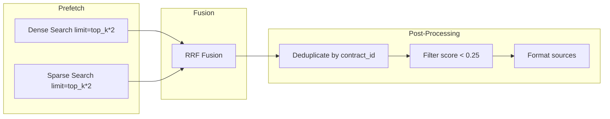

# ConPass AI Assistant — Reranking and Scoring

This document describes the current design and implementation of scoring and reranking in the retrieval pipeline.

## Reranking

| Aspect | Status |
|-------|--------|
| **Reranker** | None |
| **Cross-Encoder** | Not used |
| **Two-stage retrieval** | No — single-stage hybrid search |

The system does not include a reranking step. Results from hybrid search (RRF fusion) are used directly.

## Scoring

### Dense Vector

- **Metric**: Cosine similarity (Qdrant default for dense vectors)
- **Score threshold**: `SCORE_THRESHOLD = 0.25` applied to dense prefetch
- **Note**: Sparse prefetch does not use a score threshold; RRF fusion balances results

### Sparse Vector (BM25)

- **Metric**: BM25-style scoring (FastEmbed Qdrant/bm25)
- **Score threshold**: Not applied to sparse prefetch (per current implementation)

### RRF Fusion

- **Method**: Reciprocal Rank Fusion
- **Input**: Dense and sparse result lists (each with `limit = top_k * 2`)
- **Output**: Single ranked list with `limit = top_k`
- **Parameters**: Default RRF; not configurable in code

### Post-Fusion Filtering

- **Score threshold**: Points with `score < SCORE_THRESHOLD` (0.25) are filtered out after fusion
- **Ordering**: Results sorted by score descending, then by ID ascending for deterministic ordering

## Deduplication

| Aspect | Implementation |
|--------|----------------|
| **Unit** | `contract_id` |
| **Logic** | Keep only the highest-scoring chunk per contract |
| **Configurable** | `deduplicate_by_contract=True` (default) |

When deduplication is enabled, if multiple chunks from the same contract appear in results, only the one with the highest score is kept. This reduces redundancy when presenting sources to the user.

## Weighting Rules

| Rule Type | Status |
|-----------|--------|
| **Article type** | None |
| **Article number** | None |
| **Custom weighting** | None |

No weighting is applied based on article type, article number, or other metadata. All chunks are treated equally for scoring.

## Score Flow Summary

## Key Files

- [app/services/chatbot/tools/semantic_search/semantic_search_tool.py](../../app/services/chatbot/tools/semantic_search/semantic_search_tool.py) — `_search_qdrant_hybrid`, `_format_sources`, `SCORE_THRESHOLD`
