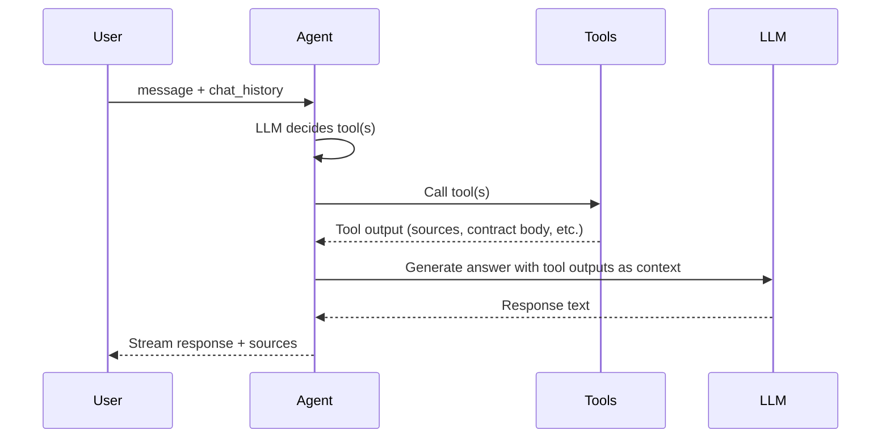

# ConPass AI Assistant — Answer Generation

This document describes the current design and implementation of answer generation in the ConPass AI Assistant.

## Prompt Structure

### System Prompt

- **Source**: `system_prompts_jp_v5.py` (Japanese)
- **Injection**: Prepended with `Today's date is {YYYY-MM-DD}.` at runtime
- **Content**:
  - Role: Contract management assistant
  - Tool selection strategy (metadata_search, semantic_search, read_contracts_tool, get_file_content_tool, document_diffing_tool, csv_generation_tool, risk_analysis_tool, web_search_tool)
  - Decision rules (e.g. do not use semantic_search when contract ID is specified)
  - Query parameter handling (use user intent, handle pagination, use conversation history when needed)
  - Citation rules (cite contract_id, contract_url; never fabricate URLs)
  - Instruction to avoid unnecessary follow-up questions

### Session Types

- **CONPASS_ONLY**: Restricted tool set (no web_search, risk_analysis)
- **GENERAL**: Full tool set

## Tool Routing and Control Policy

| User Intent | Tool | Context Provided |
|-------------|------|------------------|
| Metadata filter (company, dates, type) | metadata_search | Paginated contract list with metadata |
| Content discovery (which contracts mention X) | semantic_search | Sources with excerpt, contract_id, contract_url, score |
| Specific contract by ID | read_contracts_tool | Full contract body from ConPass API |
| Document comparison (diff between files/contracts) | document_diffing_tool | Text comparison/diff (requires combined data from get_file_content_tool and/or read_contracts_tool first) |
| CSV export or generation | csv_generation_tool | CSV content (consumes output from other tools or from document_diffing_tool) |
| Risk assessment | risk_analysis_tool | LLM analysis (contract text from ConPass API) |
| External info | web_search_tool | Web search results |

The agent selects tools based on the system prompt's decision tree. No explicit "retrieve then generate" pipeline; the agent may call multiple tools in sequence.

### Document diffing and CSV generation

- **document_diffing_tool**  
  Generates a text-based comparison or diff between multiple files or text sources. It does **not** fetch content; the agent must first call `get_file_content_tool` and/or `read_contracts_tool` to retrieve text, then pass a **combined dictionary** into this tool. When comparing a file with a contract, `get_file_content_tool` returns a dict and `read_contracts_tool` returns a list — the agent must extract `contract_body` from the list and build a single dict with both sources (e.g. `{"file_abc": "...", "contract_5814": "..."}`). Output: `success`, `diff_content`, `message`.

- **csv_generation_tool**  
  Formats data from previous tool calls into a CSV. It does **not** fetch data; input is the output of `metadata_search`, `semantic_search`, `read_contracts_tool`, `get_file_content_tool`, or (for comparison-as-CSV) the **entire output** of `document_diffing_tool`. The tool returns `csv_content` which is sent to the frontend for download; the agent must **not** display CSV data, markdown tables, or links in the chat message — only a brief confirmation.

- **Combined workflow (comparison in CSV)**  
  When the user asks for differences "in CSV" or "as CSV", the agent must call **both** tools: (1) `document_diffing_tool(data=combined_data, instruction="...")` to get the comparison, then (2) `csv_generation_tool(data=document_diffing_result, instruction="convert comparison to CSV format with columns for differences")`. Stopping after only `document_diffing_tool` does not satisfy a CSV request.

## Source Citation and Referencing

| Aspect | Implementation |
|--------|----------------|
| **Source format** | Each source: `source_number`, `contract_id`, `contract_url`, `metadata`, `excerpt`, `score` |
| **Citation instruction** | System prompt: "Use returned sources to ground answers and cite contract_id/contract_url"; "NEVER fabricate or make up URLs" |
| **URL format** | `{CONPASS_FRONTEND_BASE_URL}/contract/{contract_id}` |

Tool outputs are passed to the LLM as context. The agent is instructed to cite sources when presenting information.

## Context Injection

| Aspect | Implementation |
|-------|----------------|
| **Chunk selection order** | By score (descending) after RRF fusion and deduplication |
| **Token limit** | No explicit limit for tool output context; LLM receives full tool outputs |
| **Max contracts to read** | `read_contracts_tool`: max 4 contracts at once |
| **Semantic search results** | Deduplicated by contract_id; score threshold 0.25; all remaining sources passed |

The agent receives tool outputs as-is. There is no truncation or token budgeting for context injection at the application layer.

## Conversation History in Multi-Turn

| Aspect | Implementation |
|--------|----------------|
| **Storage** | Firestore (chat sessions with messages) |
| **Loading** | When `chat_id` is provided, existing messages are loaded and prepended to current messages |
| **Format** | `ChatMessage` (role, content, annotations) |
| **Passing to agent** | `chat_history` passed to `AgentWorkflow.run(user_msg, chat_history)` |
| **Scope** | Full conversation history for the chat session |

The agent uses conversation history for:

- Resolving references ("those contracts", "the previous search")
- Pagination (reuse query and filter_used from previous metadata_search)
- Multi-step flows (discover then read specific contract)

## Answer Generation Flow

## Key Files

- [app/services/chatbot/prompts/system_prompts_jp_v5.py](../../app/services/chatbot/prompts/system_prompts_jp_v5.py) — System prompt (Japanese), tool routing rules
- [app/services/chatbot/engine.py](../../app/services/chatbot/engine.py) — Chat engine, tool wiring, system prompt injection
- [app/services/chatbot/agent_adapter.py](../../app/services/chatbot/agent_adapter.py) — Workflow adapter, chat_history handling
- [app/services/chatbot/tools/document_diffing/document_diffing_tool.py](../../app/services/chatbot/tools/document_diffing/document_diffing_tool.py) — Document diffing tool
- [app/services/chatbot/tools/csv_generation/csv_generation_tool.py](../../app/services/chatbot/tools/csv_generation/csv_generation_tool.py) — CSV generation tool
- [docs/CSV_GENERATION_TOOL_CONTEXT.md](../CSV_GENERATION_TOOL_CONTEXT.md) — CSV generation tool context and usage
- [docs/DOCUMENT_DIFFING_TOOL_CONTEXT.md](../DOCUMENT_DIFFING_TOOL_CONTEXT.md) — Document diffing tool context and usage
