# Docker 開発環境
- 本手順書は WSL2 + Docker Desktop を前提としています。
- Windowsファイルシステム側で作業する想定とします
    - コンテナは Linuxファイルシステム側でも動きますが、Python debugger を上手く動かす方法が見つかっていません。
- Python debugger を使う場合コンテナはDBのみ利用する形で、ローカルでDjango dev server と Vue cli server を動かす形となります。
    - Pycharm Professional Edition での手順を記載します

## 事前にインストールが必要なもの
- Docker
    - WSL2環境構築手順: https://ultinet.backlog.com/alias/wiki/764709
- node.js v18.20.3
- yarn
    - こだわりがなければ `npm install -g yarn` でインストール
- Python 3.8 (Pythonをローカルでdebugする場合必要です)
- pipenv (Pythonをローカルでdebugする場合必要です)

## 開発環境構築手順
1. Windowsファイルシステム側(CやDドライブ)にリポジトリをcloneします
    ```shell
    git clone git@github.com:ultinet-inc/conpass.git
    cd conpass
    ```
   
2. 環境変数を設定する .env のコピー
    ```
    cp .env.example .env
    ```
   
3. GCPクレデンシャルの設置  

プロジェクトルート直下に以下のファイル名でGCPのクレデンシャルファイルを置きます。  
`./purple-conpass-8fd423313683.json`  
クレデンシャルファイルは以下に置いてあります。  
https://ultinet.backlog.com/file/CONPASS/%E8%A8%AD%E8%A8%88%E3%83%BB%E9%96%8B%E7%99%BA/%E8%A8%AD%E5%AE%9A/GCP/  

5. コンテナのビルド・起動
    ```shell
    docker-compose build
    docker-compose up -d
    ```
6. DBのマイグレーション
    ```shell
    docker-compose exec app bash
    python app/manage.py migrate
    python app/manage.py createsuperuser
    ```
   
    作成するユーザは適当で大丈夫です
    ```
    admin
    admin@example.com
    secret
    secret
    y
    ```

7. 静的コンテンツ用サーバの起動
    ```shell
    yarn
    yarn serve
    ```
    ※ 起動時に表示されるURLではなく次項のURLにアクセスしてください

    注意事項
   1. 環境設定で何か指定をしている場合は、.env にコピーしてからサーバを起動してください  
       例 .env.pycharm で設定した値を使いたい時
       ```shell
       cp .env.example env
       ```
    2. proxy環境で yarn に失敗した場合、以下のコマンドでproxy設定を追加してください
       ```shell
       yarn config set proxy http://192.168.4.60:9080 -g
       yarn config set https-proxy http://192.168.4.60:9080 -g
       ```
   
8. サイトにアクセス
- http://localhost:8800


## Pycharmデバッグ環境構築手順
1. Windows上にPython 3.8をインストールします。インストール済みの場合は飛ばしてください
2. Windows上にpipenvをインストールします。インストール済みの場合は飛ばしてください
3. Pycharm で当プロジェクトを開きます
4. Python Interpreter -> Add interpreter -> Pipenv Environment で Base Interpreterに python3.8を選択してOK  
    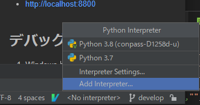  
    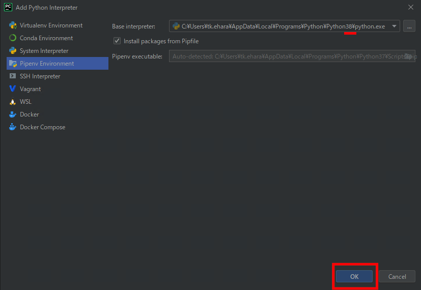  
5. ./app フォルダを Resources Root に指定します。  
    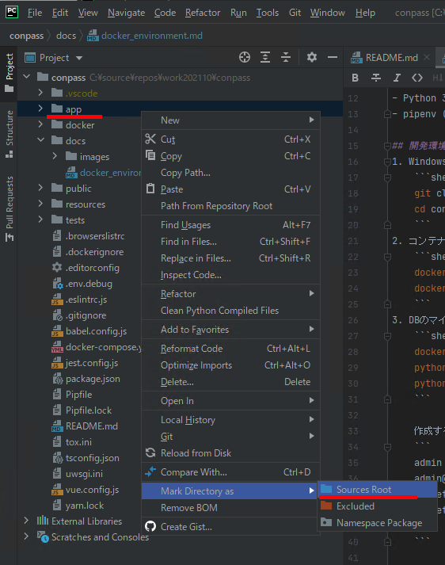
6. Add Configuration... -> + -> Django Server -> Fix  
    ※ Professional Editionの設定方法です。 CommunityEditionを使っている場合は後述する備考を参照してください    
    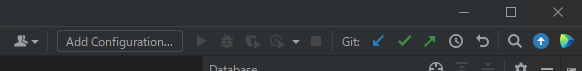

    

    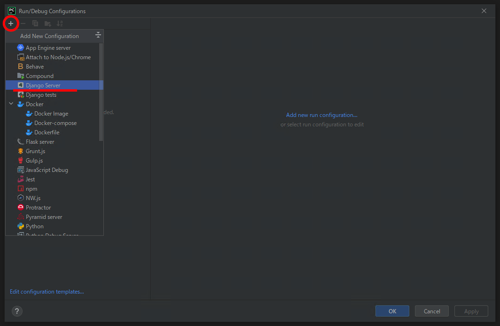

7. 以下のようにDjangoの設定をする  
    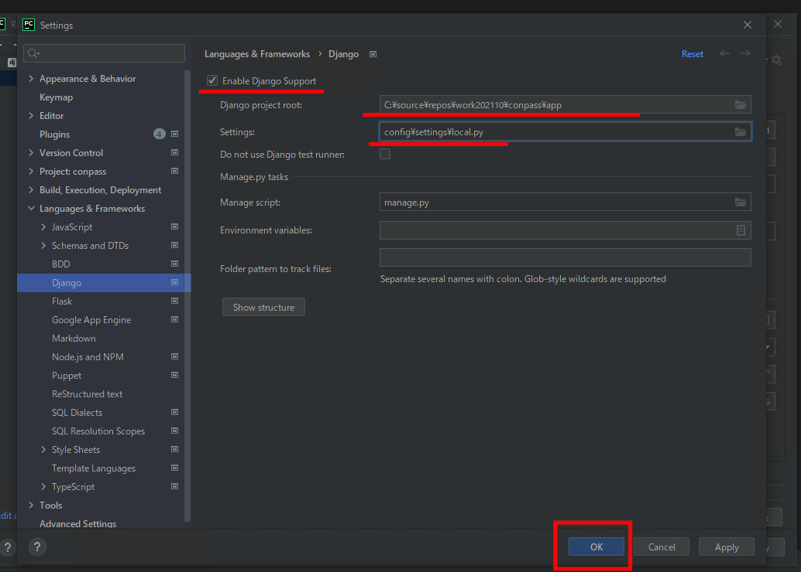

8. EnvFile の設定をする 。 プロジェクトルートにある ./.env.pycharm を設定してください。  
    ※EnvFileプラグインが必要なのでインストールしていない場合は settings -> plugins -> market placesからインストールしてください。

    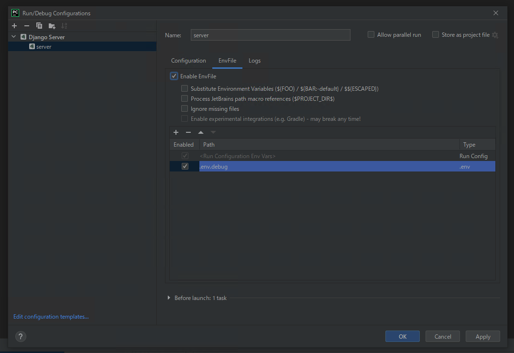

    ※ PROXY環境の場合は .env.pycharm を .env.pycharm.local にコピーして末尾に以下を追加してください。
    ```dotenv
    
    # PROXY 設定
    HTTP_PROXY=http://192.168.4.60:9080
    HTTPS_PROXY=http://192.168.4.60:9080
    NO_PROXY=127.0.0.1,localhost 
    ```
        
9. HostとPortを設定してOK

    Host: 0.0.0.0
    Port: 8811  
    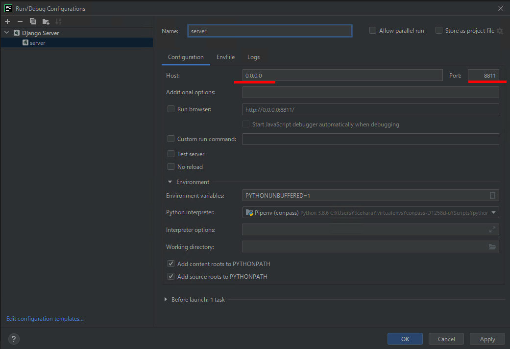

10. デバッガを起動  

    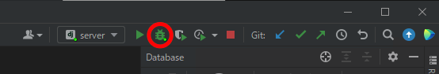  
    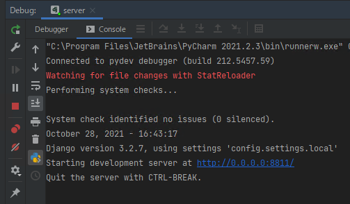  

11. コンソールからvue-cli-serverを起動する
    ```shell
    yarn serve
    ```

    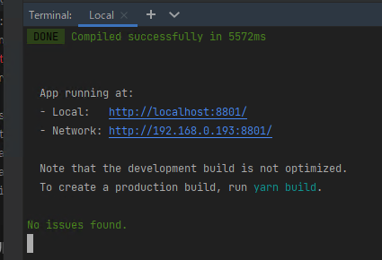

12. http://localhost:8801/api/ にアクセス（デバッグサーバの127.0.0.1:8811にproxyしています。）  
    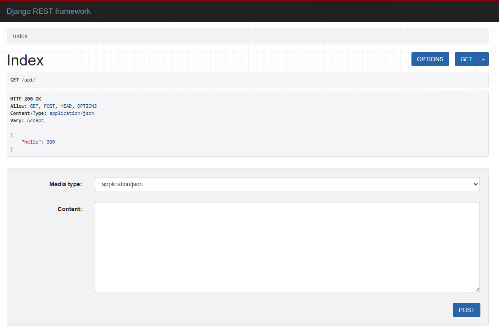

13. ./app/conpass/views.py にブレイクポイントを設定して、再度上記にアクセスして止まればデバッグ環境構築完了
    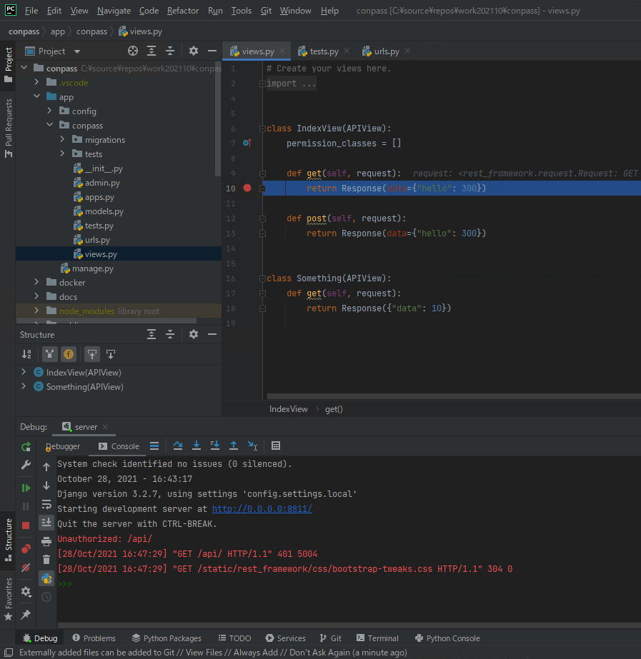


### Community Editionの場合
- だいたい一緒ですが、DjangoがサポートされていないためDjango設定ができません。

- Configurationを作成するところでDjango serverではなく Python を選択してください。  
    
    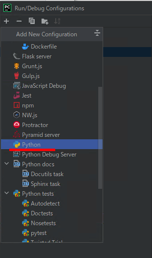  
    Parameters: runserver 0.0.0.0:8811  
    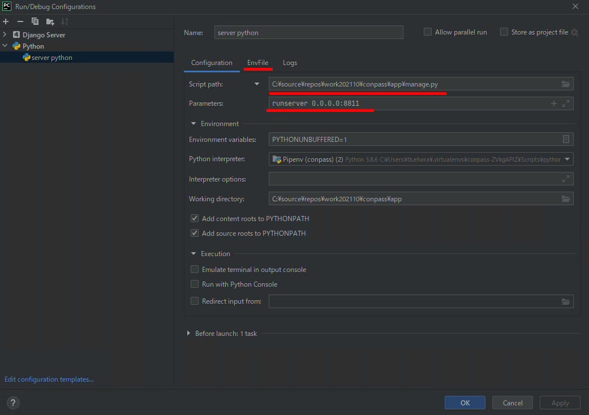  
  
- 以降の手順はデバッグ環境構築手順 手順8, 10以降と同じです。

## ユニットテストの実行

### 事前準備

開発用パッケージのインストールがまだだったら入れてください。

```shell
pipenv install --dev
```

### コンソールから実行する場合
※デバッグ環境ができている前提です。

```shell
export PIPENV_DONT_LOAD_ENV=1
pipenv run tox
```

あるいは
```shell
export PIPENV_DONT_LOAD_ENV=1
pipenv run pytest
```

DBのマイグレーションを省略したい場合、 `--reuse-db` オプションを使うと実行が早くなります
```shell
export PIPENV_DONT_LOAD_ENV=1
pipenv run pytest --reuse-db
```

### pycharmから実行する場合
1. Settings -> Languages & Frameworks -> Django -> Do not use Django test runner にチェックをつける
2. Settings -> Tools -> Python Integrated Tools -> Testing -> Default test runner で pytest を選択してOK
3. 任意のテストファイルを開いてテストを実行
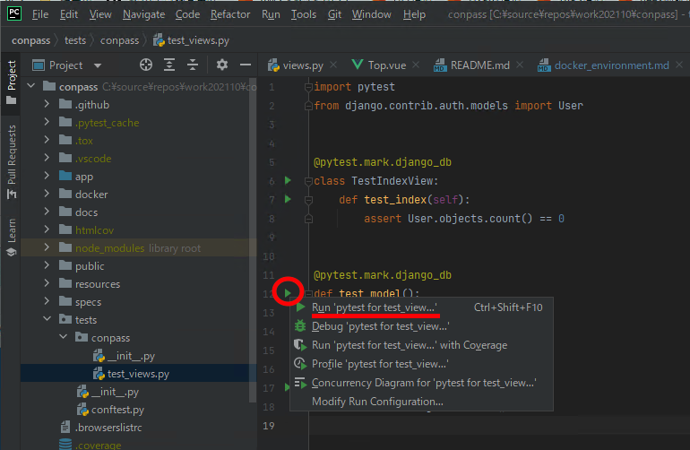


※pycharm でモジュールが見つからないような警告が出ていたら yarn でパッケージのインストールを行い、pycharm 再起動をしてください。

```shell
yarn
```
