# GCP への手動デプロイ手順

## 基本的な使用方法

- web
    - yarn build して dist/ 以下一式を CloudStorage にアップロード
- app
    - docker イメージを build し、 ArtifactRegistry に push して CloudRun で実行
- db
    - CloudSQL を使用
    - migration は app コンテナの起動コマンドで指定するなど（手動）
- redis
    - 準備中
- worker
    - 準備中

## 事前準備

- [GCP の初期設定](gcp_setting.md)
- GCS でSPAの対策を行います
  1. web側を配置する GCS のbucket のメニューから「ウェブサイトの構成を編集」を選択   
    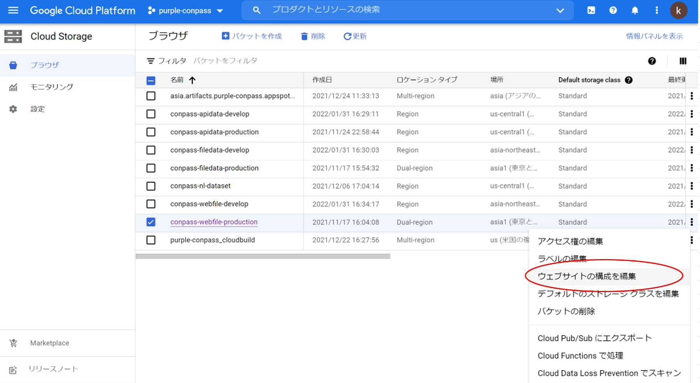
  2. 両方にindex.htmlを指定して「保存」   
    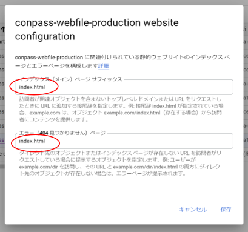
  3. これで完了です。

- ArtifactRegistry に docker login
    - https://cloud.google.com/artifact-registry/docs/docker/authentication

## app を GCP に反映する

docker イメージを build して ArtifactRegistry にpush し、CloudRun でそのコンテナを実行、という流れになります。

1. コンテナの作成

   開発環境でビルドします。  
   ArtifactRegistry の指定に従ってタグも指定します
    ```
    docker build . -f docker/app/Dockerfile --tag asia-northeast1-docker.pkg.dev/purple-conpass/conpass/conpass_app 
    ```

    なお、イメージのタグは未指定だと ```latest``` になります。
    何か指定をしたいときは、--tag の最後に :  で指定します。   
    例：タグに ```inspection``` とつけたい場合
    ```
    docker build . -f docker/app/Dockerfile --tag asia-northeast1-docker.pkg.dev/purple-conpass/conpass/conpass_app:inspection 
    ```


3. 作成されたイメージの確認  
   ※ タグ付けした名前で作成されています。
    ```
    D:\data\git\purple\conpass>docker images
    REPOSITORY                                                          TAG                            IMAGE ID       CREATED         SIZE
    asia-northeast1-docker.pkg.dev/purple-conpass/conpass/conpass_app   latest                         886b032d2a34   15 hours ago    846MB
    asia-northeast1-docker.pkg.dev/purple-conpass/conpass/conpass_app   <none>                         0ff533f0c82b   16 hours ago    846MB
    <none>                                                              <none>                         a9c83bce76ae   20 hours ago    846MB
    asia-northeast1-docker.pkg.dev/purple-conpass/conpass/conpass_app   inspection                     e775fbe6f9f0   20 hours ago    846MB
    <none>                                                              <none>                         a93acf1e4021   3 days ago      846MB      :
      :
      :
    ```

4. pushする
    ```
   docker push asia-northeast1-docker.pkg.dev/purple-conpass/conpass/conpass_app
    ```

5. CloudRun でコンテナの起動をする

    CloudSQLとの接続設定についても記載します。   
    起動する際に環境変数および、必要なら起動コマンドを指定します。

   1. CloudRunでデプロイするインスタンスを選択
      - ```conpass-app``` がリリース前の開発環境（リリース後は本番環境） 
      - ```conpass-app-develop``` がリリース前の検証環境 
      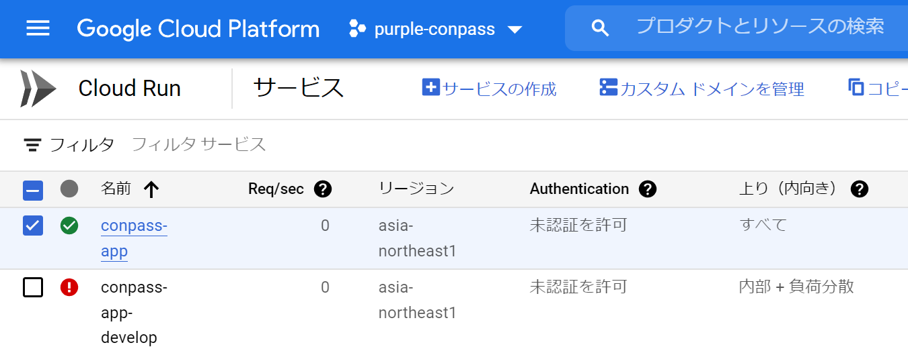
   2. 「新しいリビジョンの編集とデプロイ」を選択
      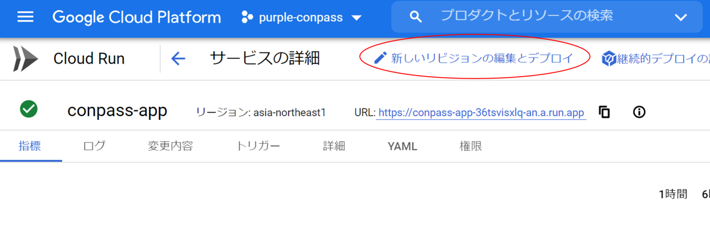
   3. コンテナイメージのURLには、ArtifactRegistry で push したコンテナを選びます。
       - 「コンテナイメージのURL」フォーム内右側の「選択」をクリックしてダイアログを表示して選択
       - ※デフォルトだと ```CONTAINER REGISTRY``` のほうになっていますので、タブを切り替えて ```ARTIFACT  REGISTRY``` にしてください
         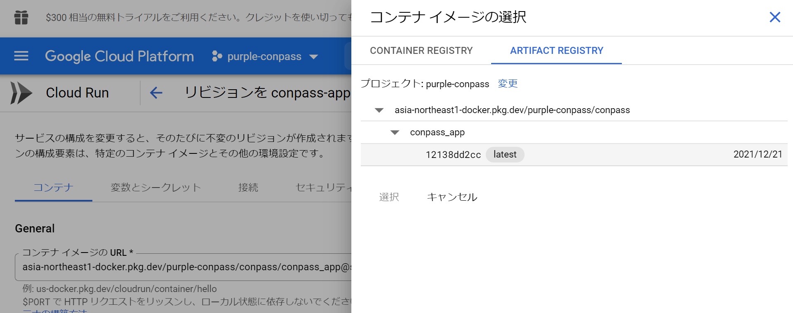
       - 例
       - ```asia-northeast1-docker.pkg.dev/purple-conpass/conpass/conpass_app@sha256:12138dd2cc07f8a84b6276b044688bbde4026d3359fb340cb30ac203cd106e13```
         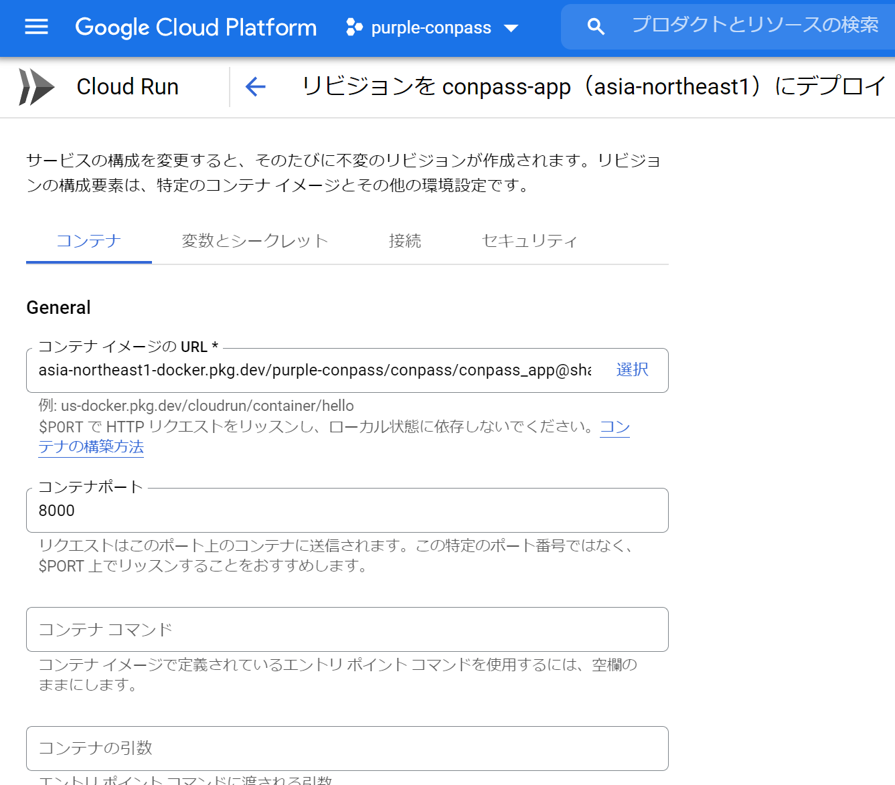
   4. 起動コマンドを指定する場合は、ここの「コンテナコマンド」「コンテナの引数」で指定します
       - 例：マイグレーションする時
       - ```python app/manage.py migrate``` を実行したい
         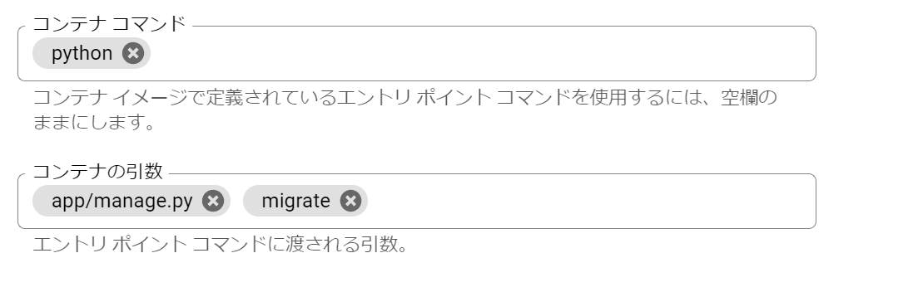
   5. 「変数とシークレット」タブで環境変数を指定します    
      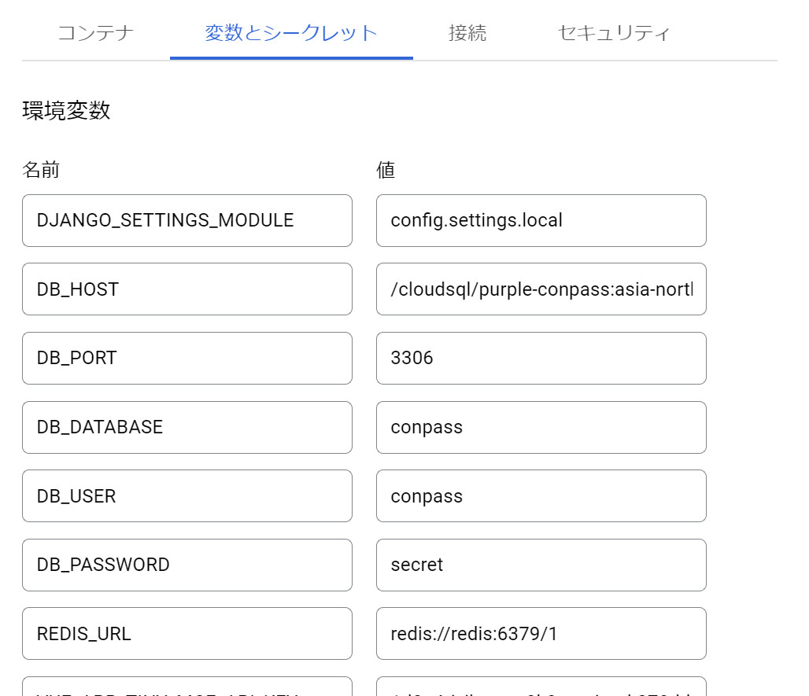
      ※適宜必要な分だけ指定します。
       - 検証環境（conpass-app-develop）の環境変数は .env.inspection の記載を参考にしてください。
         - ※ 主に以下の点が異なります
           - GCS_BUCKET_NAME が develop の方を向く
           - DB_HOST が develop の方を向く
       - DB_HOST には、"/cloudsql/" に続けて CloudSQL の接続名を指定します。
       - ```/cloudsql/{CloudSQLの接続名}```
         - 開発環境（本番環境）と検証環境で異なります 
           - 開発環境（本番環境）
             - ```/cloudsql/purple-conpass:asia-northeast1:conpass-db-production```
           - 検証環境
             - ```/cloudsql/purple-conpass:asia-northeast1:conpass-db-develop```
         - 接続名はCoundSQLの管理画面で確認が可能です。
         - 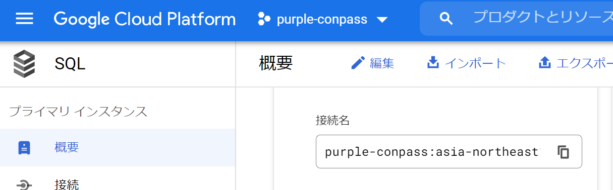
   6. CloudSQLに接続する場合は、CloudRunの「接続」タブで、CloudSQL接続の指定もしておいてください。   
      ※プルダウンで選択できます
      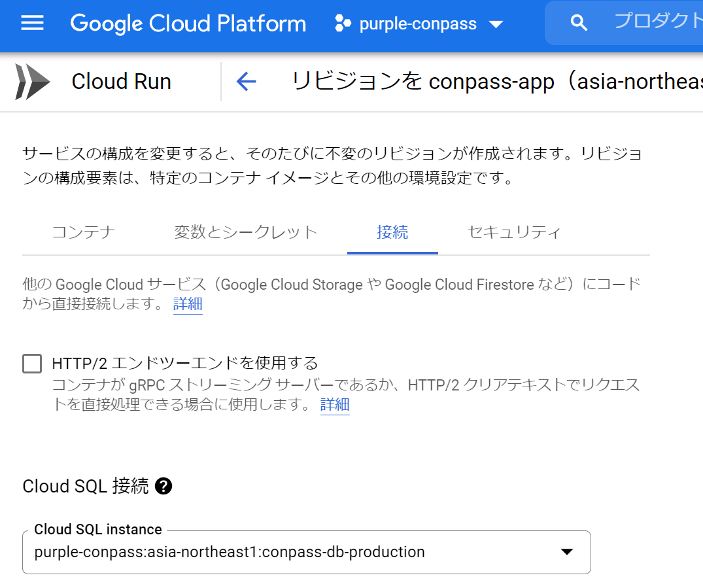
   7. 画面下側にある「デプロイ」ボタンを押してデプロイします。
       - ログなどで起動状況を確認してください。
       - 起動コマンドでマイグレーションなどを行った場合は起動自体はエラーとなりますので、ログなどから起動コマンドが成功したかどうか確認した上で、改めて起動コマンド無しの新しいリビジョンを作成し、起動してください。

## web を GCP に反映する

1. 開発環境でビルドを行います  
    - 開発環境（本番環境）の場合（```.env``` の環境変数を参照する）
    ```
    yarn build
    ```
    - 検証環境用の場合（```.env.inspection``` の環境変数を参照する）
    ```
    yarn build --mode inspection
    ```

3. dist 階層が生成されるので、その一式をGCSにアップロードする
    - アップロードするbucket名は以下になります。
      - 開発環境（本番環境）の場合、```conpass-webfile-production```
      - 検証環境の場合、```conpass-webfile-develop```
    - bucket名は GCPの画面で確認ができます。    
      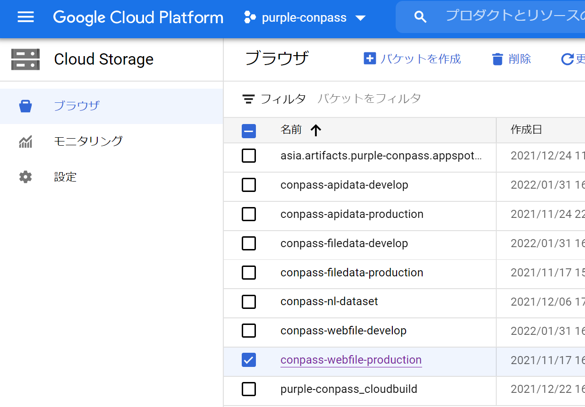

アップロード手段は適宜検討してください

- CGPのコンソールから
    - 1階層ずつ行うことになる
- gsutil を使う
    - gsutil は cloudSDK に含まれています。
    - ```gsutil -m cp -R dist/* gs://conpass-webfile-production```
    - ```gsutil -m cp -R dist/* gs://conpass-webfile-develop```
        - （dist階層の１つ上で実行）

## db を GCP に反映する

現状、マイグレーションやfixtureのロードは app を GCP に反映する際の起動コマンドで指定しています。   
そのため、fixtureが何ファイルもある場合は、コンテナコマンド、コンテナの引数を書き換えながらコンテナを何度も起動しなおす形になっています。


