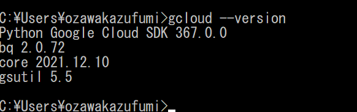
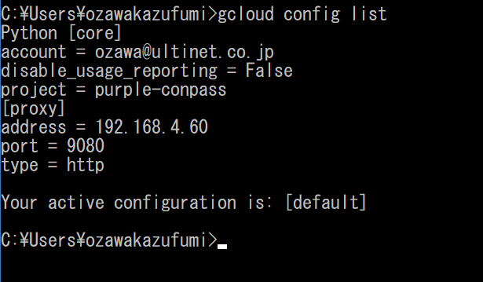
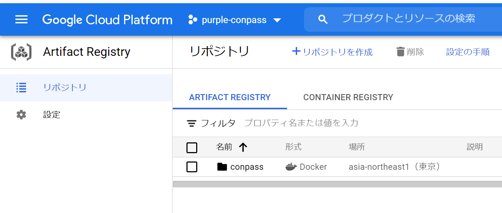
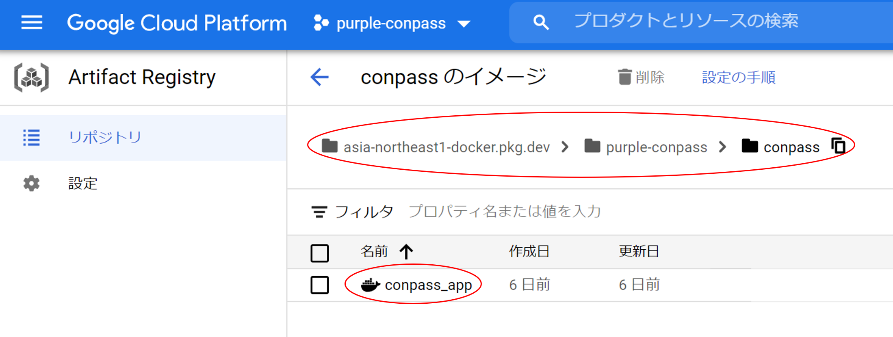

# GCP の初期設定

ここでは、ローカル環境からGCPに接続できるようにする為の設定について記載します。

## 事前準備

※ ネットワーク設定など、インフラ側の設定は完了している想定です。

### CloudSDK のインストール

開発環境から cli で GCP にアクセスするためのツールをインストールします

[クイックスタート: Cloud SDK スタートガイド](https://cloud.google.com/sdk/docs/quickstart)

#### windows の場合

[クイックスタートのリンクにあるインストーラ](https://dl.google.com/dl/cloudsdk/channels/rapid/GoogleCloudSDKInstaller.exe?hl=JA) を使ってのインストールは
proxy の為か途中で止まってしまうため、全部入りのパッケージからインストールします。

1. https://cloud.google.com/sdk/docs/downloads-versioned-archives?hl=ja から対応するパッケージをダウンロード  
   ※実施時は Python は別途インストール済だったので、Python バンドルの無い ```Windows 64 ビット（x86_64）``` を選択しました
2. zip を解凍し、中に入っている install.bat を実行します
3. 何度か質問されますが、YESにする  
   ```do you want to help improve the google clound sdk?``` → Y  
   ```update %PATH% to include cloid sdk binaries```  → Y   
   （ただ、実際に試行した時はパス設定に失敗しました）
4. パス設定が出来なかった場合は手動で設定する
    1. windows の設定を開いて「システム」→「詳細設定」→「システムの詳細設定」
    2. システムのプロパティが開くので「詳細設定」タブ→「環境変数」
    3. 「環境変数」の設定ウインドウが開くので、「Path」を選んで「編集」   
       （ユーザ環境変数かシステム環境変数かは好みで）
    4. 「新規」でCloudSDKのバイナリのパスを追加。（ {インストールしたパス｝/bin/ になります）
5. 動作確認する
    - コマンドプロンプトを開いて、 ```gcloud --version``` と入力。以下のような表示になればOKです。   
      
    - ※python 同梱版にしなかったためか、gcloudコマンドを実行すると最初に```Python```と表示がされるようです。

### CloudSDK の初期設定をする

コマンドプロンプトで gcloud を使って設定してゆきます

1. ```gcloud init``` を実行
2. 通信エラーになる場合はそのまま対話形式で proxy の設定になります
    ```
    Checking network connection...done.
    ERROR: Reachability Check failed.
        httplib2 cannot reach https://accounts.google.com:
    [WinError 10049] 要求したアドレスのコンテキストが無効です。
    
        httplib2 cannot reach https://cloudresourcemanager.googleapis.com/v1beta1/projects:
    [WinError 10049] 要求したアドレスのコンテキストが無効です。
    
        httplib2 cannot reach https://www.googleapis.com/auth/cloud-platform:
    [WinError 10049] 要求したアドレスのコンテキストが無効です。
    
        httplib2 cannot reach https://dl.google.com/dl/cloudsdk/channels/rapid/components-2.json:
    [WinError 10049] 要求したアドレスのコンテキストが無効です。
    
    Network connection problems may be due to proxy or firewall settings.
    
    Current effective Cloud SDK network proxy settings:
    (These settings are from your machine's environment, not gcloud properties.)
        type = http
        host =
        port = 443
        username = None
        password = None
    ```
3. この場で設定するか聞かれますので、YES
    ```
    Do you have a network proxy you would like to set in gcloud (Y/n)?
    ```
   → Y

※以下は環境に合わせて適宜調整してください

4. proxy種別を設定
    ```
    Select the proxy type:
     [1] HTTP
     [2] HTTP_NO_TUNNEL
     [3] SOCKS4
     [4] SOCKS5
    Please enter your numeric choice: 
    ```
   → 1

5. proxyのアドレスを設定
    ```
    Enter the proxy host address: 
    ```
   →192.168.4.60

6. proxyのポートを設定
    ```
    Enter the proxy port: 
    ```
   → 9080

7. proxyに認証はあるかどうか
    ```
    Is your proxy authenticated (y/N)?  
    ```
   → N （無い）

8. これで proxy 設定は完了です。最後に自動で疎通確認が行われます。
    ```
    Cloud SDK proxy properties set.
    
    Rechecking network connection...done.
    Reachability Check now passes.
    Network diagnostic passed (1/1 checks passed).
    ```

9. 続いてgoogleのログインを行います
     ```
     You must log in to continue. Would you like to log in (Y/n)?  
     ```
   → Y

    ```
    Your browser has been opened to visit:
    
        https://accounts.google.com/o/oauth2/auth?*********
    ```
   自動でブラウザが開きますので、そちらでgoogleアカウントのログインを行い、CloudSDK に許可を与えます。   
   もしブラウザのgoogleアカウントを間違えた、ブラウザウィンドウを閉じてしまった、という場合はコマンドプロンプトで表示されているURLから再度アクセス可能です。

10. ブラウザでログインし、許可を与えると端末の方もログイン完了になります。
    ```
    You are logged in as: [｛ログインしたgoogleのメールアドレス｝].
    ```

11. 続いてプロジェクトを選択します

    ログインしたアカウントが参加しているプロジェクト一覧が表示されるので、該当プロジェクトを選択
    ```
    Pick cloud project to use:
     [1] **************
     [2] **************
     [3] purple-conpass
     [4] Create a new project
    Please enter numeric choice or text value (must exactly match list item):  
    ```
    → （ここでは）3

13. デフォルトリージョンとゾーン設定するか聞かれますが、設定しませんでした
    ```
    Do you want to configure a default Compute Region and Zone? (Y/n)?  
    ```
    → N

13. 設定を確認する
    ```
    gcloud config list
    ```
    

これでgcloud の初期設定は完了です。

### docker と連携させる

docker コマンドの push でGCPのレジストリに push 出来るように、gcloud認証ヘルパーを使って認証情報を連携させます。

参考
https://cloud.google.com/artifact-registry/docs/docker/authentication#gcloud-helper

1. Cloud SDK にログイン   
   これは前項でログイン済なので省略します
2. リポジトリを追加する
    - ArtifactRegistry のパスをGCPのコンソールで確認する
    - ArtifactRegistry の管理画面にアクセス
         
         conpass を選択   
         ここでは ```asia-northeast1-docker.pkg.dev``` となっていることを確認  
         ※ 後でdocker image のタグ付けにも使うので、フルパスで覚えておいてください
         

    - ArtifactRegistry の表示を確認して、asia-northeast1-docker.pkg.dev を追加します
        ```
        gcloud auth configure-docker asia-northeast1-docker.pkg.dev
        ```

    - config.json を更新して良いか聞かれたのでYES
        ```
        Python WARNING: Your config file at [C:\Users\ozawakazufumi\.docker\config.json] contains these credential helper entries:
     
        {
          "credHelpers": {
            "asia.gcr.io": "gcr",
            "eu.gcr.io": "gcr",
            "gcr.io": "gcr",
            "staging-k8s.gcr.io": "gcr",
            "us.gcr.io": "gcr"
          }
        }
        Adding credentials for: asia-northeast1-docker.pkg.dev
        After update, the following will be written to your Docker config file located at
        [C:\Users\ozawakazufumi\.docker\config.json]:
         {
          "credHelpers": {
            "asia.gcr.io": "gcr",
            "eu.gcr.io": "gcr",
            "gcr.io": "gcr",
            "staging-k8s.gcr.io": "gcr",
            "us.gcr.io": "gcr",
            "asia-northeast1-docker.pkg.dev": "gcloud"
          }
        }
     
        Do you want to continue (Y/n)?  
        ```
         → Y
3. 設定確認をする

   docker の config.json を確認します。 
      - コマンドプロンプトの場合
          ```
          type %USERPROFILE%\.docker\config.json
          ```
      - gitbash の場合
          ```
          cat ~/.docker/config.json
          ```
      config.json の credHelpers に前項の gcloud auth で指定した ```"asia-northeast1-docker.pkg.dev": "gcloud"```が追加されていればOKです
      ```
    {
       "auths": {},
       "credHelpers": {
         "asia.gcr.io": "gcr",
         "eu.gcr.io": "gcr",
         "gcr.io": "gcr",
         "staging-k8s.gcr.io": "gcr",
         "us.gcr.io": "gcr",
         "asia-northeast1-docker.pkg.dev": "gcloud"
       },
       "credsStore": "desktop",
       "proxies": {
         "default": {
           "httpProxy": "http://192.168.4.60:9080",
           "httpsProxy": "http://192.168.4.60:9080",
           "noProxy": "127.0.0.1,localhost,172.*.*.*"
         }
       }
    }
    ```
   
   念の為 gcloud の方も確認    
   ```gcloud artifacts locations list``` を実行   
   asia-northeast1 が入っていればOK
   ```
   D:\data\git\purple\conpass>gcloud artifacts locations list
   Python LOCATIONS
   asia
   asia-east1
   asia-east2
   asia-northeast1
   asia-northeast2
   asia-northeast3
   asia-south1
   asia-south2
   asia-southeast1
   asia-southeast2
      :
   （以下略）
   ```

### CloudSQLに cloud_sql_proxy 経由で接続する初期設定をする

- ローカル環境にmysqlのコンソールが必要
- Cloud SQL Auth Proxy クライアントをインストールする
- firewallなどで通信が止められている場合は開放申請が必要

1. （もし無ければ）ローカル環境にmysqlのコンソールをインストールする
- 参考
  - [mysql クライアントをインストールする](https://cloud.google.com/sql/docs/mysql/quickstart-proxy-test?hl=ja#install_a_client)

クライアント候補
- mysql クラアント
  - windows では単体で提供されないので、CommunityServer をインストールする形になる
- A5:SQL Mk-2
- HeigiSQL
- など…

cliであれば、WSLでmysqlクライアントをインストールするのが楽かもしれません。

2. Cloud SQL Auth Proxy クライアントをインストールする

https://cloud.google.com/sql/docs/mysql/quickstart-proxy-test?hl=ja#install-proxy
から適宜インストールします

3. firewallなどで通信が止められている場合は開放申請が必要

cloudSQLの対象DBインスタンスのIPアドレスに対し、指定のポート（3306, 3307）で接続する為、firewallなどで止まられていたら開放してもらってください。


これで事前準備は完了です。


### CloudSQLに cloud_sql_proxy 経由で接続する

cloud_sql_proxy を起動するターミナルと、SQLを発行するクライアントそれぞれが必要です。   
CLIならターミナルが２つ必要なので、WSL内で実行する場合は、WSLのターミナルが２つとなります。
また、GCPのクレデンシャルファイルが必要になりますので、用意してください。

```
.\cloud_sql_proxy -dir=.\cloudsql -instances=purple-conpass:asia-northeast1:conpass-db-production=tcp:0.0.0.0:3306 -credential_file=.\purple-conpass-8fd423313683.json -log_debug_stdout=true
```
をターミナルで実行しておきます。（上記はWSL内で実行した場合の例）

mysqlクライアントでは以下で接続します
```
mysql -u root -p -h 127.0.0.1
```

パスワードは以下を参照してください。（入れない方は分かる人に聞いてください）
- [conpass-db-production のパスワード](https://lbsk.backlog.com/alias/file/18556815)
- [conpass-db-develop のパスワード](https://lbsk.backlog.com/view/PURPLE_PJ_INTERNAL-37#comment-129163735)

