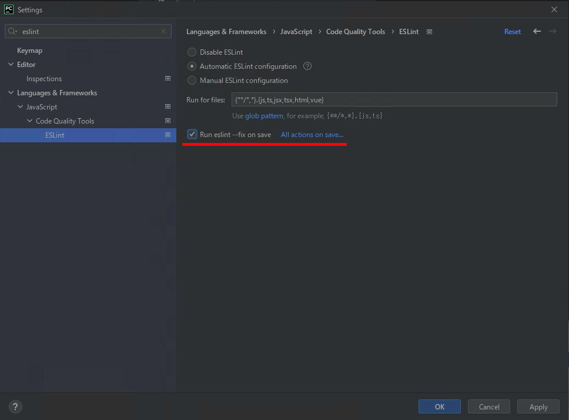

## ESLint の自動FIX

ファイル保存時にある程度自動で修正してくれる設定があるので、可能な限り設定をお願いします。

### Pycharm Professional Edition の場合
Settings -> Languages & Frameworks -> JavaScript -> Code Quality Tools -> ESLint -> Run eslint --fix on save にチェック

### VSCodeの場合
TODO

## EditorConfigの設定

.editorconfig で改行コード、タブスペースなどの設定をしているのでEditorConfigプラグインの導入をお願いします。

### Pycharm Professional Editionの場合
デフォルトで入っているので追加の作業はありません。

### VSCodeの場合
EditoConfigプラグインをインストールしてください。
